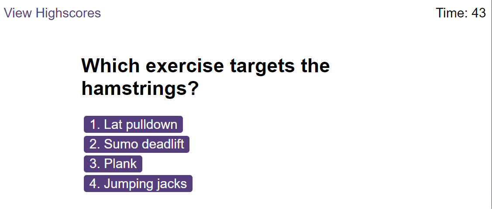
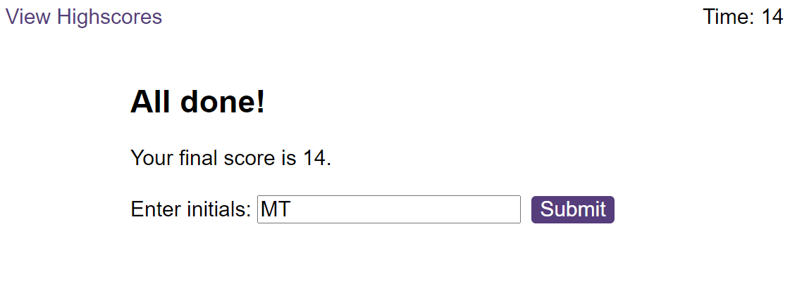

# Module 6 Quiz challenge
Task to fix the code for a quiz, where there is a timer to answer questions and create a leaderboard

## Description

I was given a code to create a quiz with the following characteristics:
- A timer starts when the button 'start' is clicked on
- A question is given with different answer choices
- A sound effect is played when an answer is correct or wrong
- A score is given at the end

## Installation
Code was built on Visual Studio Code.
Click on following link to view website and github repository. Contains HTML and javascript file, and images in assets folder

## Usage
Click on start to begin quiz. Questions will be asked with multiple-choice answers for the user to select from. There is a timer at the same time and when a question is answered incorrectly, then more time is reduced. At the end, a score is given and you can enter your name for the leaderboard

*Leaderboard is currently being fixed

## Deployment link:
[Completed challenge] (https://mtruong1995.github.io/quiz-challenge/)

## Repo link:
[Repository] (https://github.com/mtruong1995/quiz-challenge)

## Screenshot:

## Credit

-With help from https://fantastic-pudding.vercel.app/ and Drew from edx Web development course.
